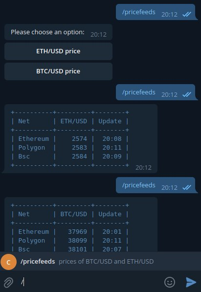

# How to build a Telegram bot to show Chainlink *price feeds*

The main idea of this tutorial is to show an example of how to develop a **Telegram bot** that consumes **Chainlink price feeds** for BTC/USD and ETH/USD pair of assets from **Ethereum, Polygon and Binance Smart Chain** mainnets.
The progam language used is **python** 

This development was intended as an example to learn how to get prices from Chainlink in a simple way. If someone has in mind to put this bot into production environment I suggest implementing the price requests in asynchronous calls, the simplified cache in this code could be replaced by REDIS as a better tunable cache and it's a good practice to refactor get_eth and get_btc functions into another more generic function to cover more price feeds. (refactored function in https://github.com/apronotti/telegram-bot-to-show-chainlink-price-feeds/tree/refactoring-by-unifying-the-price-getter )

## Useful documentation


 Source code of python-telegram-bot https://github.com/python-telegram-bot/python-telegram-bot
  


**Price feeds**    https://docs.chain.link/docs/reference-contracts/
## Introduction
This library provides a pure Python, lightweight interface for the [Telegram Bot API](https://core.telegram.org/bots/api). It's compatible with Python versions 3.6.8+. PTB-Raw might also work on [PyPy](http://pypy.org/), though there have been a lot of issues before. Hence, PyPy is not officially supported.

python-telegram-bot-raw is part of the [python-telegram-bot](https://python-telegram-bot.org/) ecosystem and provides the pure API functionality extracted from PTB. It therefore does not have independent release schedules, changelogs or documentation. Please consult the PTB resources.


### Screenshot 



## Requeriments

### Python3 modules

 * **DateTime** version 4.4
 * **numpy version** 1.17.4
 * **prettytable** version 0.7.2
 * **python-telegram-bot** version 13.11
 * **requests** version 2.25.1
 * **web3** version 5.11.1

## Install

```
  git clone https://github.com/apronotti/telegram-bot-to-show-chainlink-price-feeds.git
  cd telegram-bot-to-show-chainlink-price-feeds
  pip install -r requirements.txt
```
## Generate your bot and Access Token
To generate an **Access Token**, you have to talk to [@BotFather](https://t.me/BotFather) and follow a few simple steps (described [here](https://core.telegram.org/bots#6-botfather)). 

## Config

With the bot **Access TOKEN** obtained in the former step:
1. Copy or rename the file **config.json.example** as **config.json**
2. Edit config.json file and replace the word **TOKEN** for the current **Telegram Access TOKEN value**
3. Obtain and replace the **project ids* in congig.json for the RPC providers (example: Infura, Alchemy) to access the Ethereum and Polygon networks


## Runing the bot

```
python3 btc_eth_query_prices_n_blockchains.py
```

## Installing the bot
Once the bot was generated in the former step titled **"Generate your bot and Access Token"**, in Telegram app click on https://t.me/[NAME_OF_THE_BOT]
You need to replace NAME_OF_THE_BOT with your bot name 
or 
if you want, you can try the example bot at https://t.me/btc_eth_cl_query_prices_bot

## Using the bot
1. In the Telegram App message field type **/start**, this command is used only one time to initialize the bot.
2. Each time you want to query prices type **/pricefeeds**
3. Choose one of the options **"BTC/USD price"** or **"ETH/USD price"**

---

## Aditional information
### Step by step, how to query a Chainink price feed in python

 1. Go to https://docs.chain.link/docs/reference-contracts/
 2. Click on the chosen chain for example Ethereum
 3. Copy the ETH/USD Proxy contract address 0x9326BFA02ADD2366b30bacB125260Af641031331 and use it in the next example.


This example uses Web3 module to retrieve feed data from the ETH / USD feed on the Ethereum network.
In a terminal execute the fololowing commands:

```
# pip install web3
# python3
Python 3.8.10 (default, Nov 26 2021, 20:14:08) 
[GCC 9.3.0] on linux
Type "help", "copyright", "credits" or "license" for more information.
>>> from web3 import Web3
>>> web3 = Web3(Web3.HTTPProvider('https://kovan.infura.io/v3/<infura_project_id>'))
>>> abi = '[{"inputs":[],"name":"decimals","outputs":[{"internalType":"uint8","name":"","type":"uint8"}],"stateMutability":"view","type":"function"},{"inputs":[],"name":"description","outputs":[{"internalType":"string","name":"","type":"string"}],"stateMutability":"view","type":"function"},{"inputs":[{"internalType":"uint80","name":"_roundId","type":"uint80"}],"name":"getRoundData","outputs":[{"internalType":"uint80","name":"roundId","type":"uint80"},{"internalType":"int256","name":"answer","type":"int256"},{"internalType":"uint256","name":"startedAt","type":"uint256"},{"internalType":"uint256","name":"updatedAt","type":"uint256"},{"internalType":"uint80","name":"answeredInRound","type":"uint80"}],"stateMutability":"view","type":"function"},{"inputs":[],"name":"latestRoundData","outputs":[{"internalType":"uint80","name":"roundId","type":"uint80"},{"internalType":"int256","name":"answer","type":"int256"},{"internalType":"uint256","name":"startedAt","type":"uint256"},{"internalType":"uint256","name":"updatedAt","type":"uint256"},{"internalType":"uint80","name":"answeredInRound","type":"uint80"}],"stateMutability":"view","type":"function"},{"inputs":[],"name":"version","outputs":[{"internalType":"uint256","name":"","type":"uint256"}],"stateMutability":"view","type":"function"}]'
>>> addr = '0x9326BFA02ADD2366b30bacB125260Af641031331'
>>> contract = web3.eth.contract(address=addr, abi=abi)
>>> latestData = contract.functions.latestRoundData().call()
>>> print(int(round(latestData[1] / 10 ** 8, 0)))
2952
```
  
### Chainlink price queries are implemented in the following part of the source code of the bot

```
...

ABI_CL_PRICE_FEED= '[{"inputs":[],"name":"decimals","outputs":[{"internalType":"uint8","name":"","type":"uint8"}],"stateMutability":"view","type":"function"},{"inputs":[],"name":"description","outputs":[{"internalType":"string","name":"","type":"string"}],"stateMutability":"view","type":"function"},{"inputs":[{"internalType":"uint80","name":"_roundId","type":"uint80"}],"name":"getRoundData","outputs":[{"internalType":"uint80","name":"roundId","type":"uint80"},{"internalType":"int256","name":"answer","type":"int256"},{"internalType":"uint256","name":"startedAt","type":"uint256"},{"internalType":"uint256","name":"updatedAt","type":"uint256"},{"internalType":"uint80","name":"answeredInRound","type":"uint80"}],"stateMutability":"view","type":"function"},{"inputs":[],"name":"latestRoundData","outputs":[{"internalType":"uint80","name":"roundId","type":"uint80"},{"internalType":"int256","name":"answer","type":"int256"},{"internalType":"uint256","name":"startedAt","type":"uint256"},{"internalType":"uint256","name":"updatedAt","type":"uint256"},{"internalType":"uint80","name":"answeredInRound","type":"uint80"}],"stateMutability":"view","type":"function"},{"inputs":[],"name":"version","outputs":[{"internalType":"uint256","name":"","type":"uint256"}],"stateMutability":"view","type":"function"}]'

# Read configuration from config.json
config = Configuration.load_json('config.json')
web3_ethereum = Web3(Web3.HTTPProvider(config.ethereum.apiprovider))

...

# Read configuration from config.json
config = Configuration.load_json('config.json')
web3_ethereum = Web3(Web3.HTTPProvider(config.ethereum.apiprovider))
...

def hours_from_timestamp(self, timestampValue) -> str:
    # convert timestamp to string of datetime format
    date = str(dt.datetime.fromtimestamp(timestampValue))
    # extract hours without seconds
    hours = date[-8:][:-3]
    return hours

# Query the price of ETH/USD from Ethereum, Polygon and Bsc networks
def get_eth(self) -> str:
    addr = self.config.ethereum.cl_contract_address.etherusd
    contract = self.web3Ethereum.eth.contract(address=addr, abi=self.ABI_CL_PRICE_FEED)
    # ETH/USD price query from Ethereum mainnet
    latest_data = contract.functions.latestRoundData().call()
    ethereum_data = (
            'Ethereum', latest_data[1], self.hours_from_timestamp(latest_data[2]))

    ...

```
